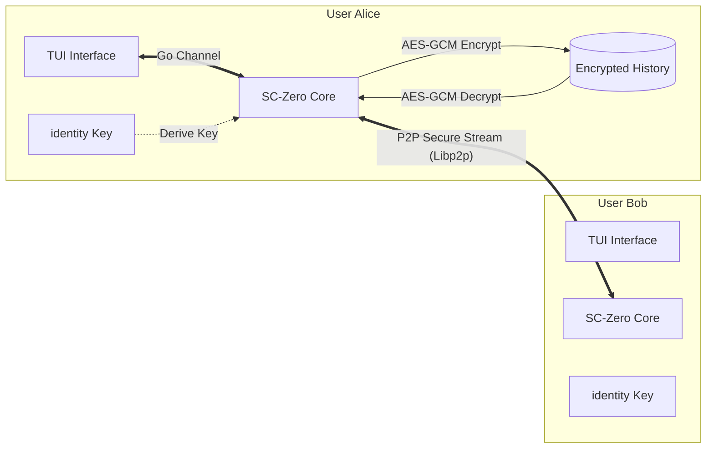

# Project: SC-Zero
### Serverless P2P Encrypted Messenger (TUI Edition)

## 1. 프로젝트 개요 (Overview)
* **개발 기간**: 2025.12.1 ~ 2025.12.14
* **소개**: 중앙 서버 없이 노드 간 직접 연결(P2P)을 통해 통신하며, 대화 내용을 로컬에 암호화하여 저장하는 탈중앙화 메신저입니다
* **개발 동기**:
    * 기존 'Zero-Knowledge Server' 방식조차 서버가 존재한다는 단일 실패 지점(SPOF)의 한계를 극복하고자 했습니다
    * **Libp2p**를 도입하여 진정한 의미의 **Serverless & Decentralized** 아키텍처를 구현했습니다
    * 전송 구간 보안(Transport Security)뿐만 아니라 저장 데이터(Data at Rest)까지 보호하는 **Full Security**를 달성했습니다

### 프로젝트 폴더 구조 (Modular Architecture)
```plaintext
SC-Zero/
├── go.mod
├── go.sum
├── cmd/
│   └── node/
│       └── main.go       # [Main] 모듈 조립 및 프로그램 진입점
├── internal/             # [Internal] 핵심 로직 모음
│   ├── core/             # 공통 타입 및 인터페이스
│   ├── p2p/              # Libp2p 네트워크 로직 (스트림 핸들링, 연결 관리)
│   ├── storage/          # 암복호화 및 파일 입출력
│   └── ui/               # TUI 화면 구성 및 사용자 인터랙션
├── identity.key          # 노드 신원 증명용 개인키 (비대칭 키)
└── chat_history.enc      # 암호화된 대화 로그 (AES-256-GCM)
```

## 2. 사용 기술 (Tech Stack)
* **Language**: Go (Golang)

* **UI**:
    * **Library**: `tview`, `tcell`

* **Network (P2P)**:
    * **Library**: `go-libp2p`
    * **Protocol**: Custom Protocol ID `/sc-zero/1.0.0`
        * **네트워크 격리 (Network Isolation)**: 버전 불일치 시 자동 연결 거부
        * **미래 확장성 (Future Proofing)**: 프로토콜 버저닝을 통한 하위 호환성 대비
        * **핸드셰이크 검증 (Handshake Verification)**: 연결 수립 시 프로토콜 ID 검증
    * **Discovery**: Multiaddr 기반 직접 연결 (Direct Connection)

* **Cryptography**:
    * **Transport Layer**: TLS 1.3 / Noise (Libp2p)
    * **Storage Layer**: AES-256-GCM (개인키 기반 키 파생)
    * **Key Derivation**: SHA-256

* **Storage**: JSON Serialization + Binary Encryption

## 3. 핵심 기능 및 보안 설계 (Key Features)
### 1. Serverless P2P Architecture
* **중앙 서버 제거**: 중계 서버(Relay) 없이, 각 클라이언트가 **노드(Node)**가 되어 상호 직접 연결합니다
* **검열 저항성**: 특정 IP나 서버를 차단해도, P2P 네트워크 특성상 통신을 완전히 차단할 수 없습니다

### 2. 암호화된 로컬 저장소 (Secure Local Storage)
* **개인키 기반 저장**: 사용자의 `identity.key`(개인키)가 없으면 복호화할 수 없는 강력한 보안 저장소를 구현했습니다
* **AES-256-GCM**: 단순 암호화뿐만 아니라 데이터 무결성까지 검증하여, 로컬 파일 변조를 감지합니다

### 3. TUI (Text-based User Interface)
* **실시간 채팅**: 고루틴(Goroutine) 기반 비동기 UI 렌더링으로, 메시지 송수신 중에도 끊김 없는 사용자 경험을 제공합니다
* **명령어 기반 제어**: 직관적인 명령어를 통해 프로그램 제어 및 정보 조회가 가능합니다

### 4. 암호학적 신원 증명 (Identity)
* **Node ID**: 로그인 ID/PW 대신, 비대칭 키 쌍(Public/Private Key)을 통해 생성된 고유한 **Node ID**를 사용합니다
* 프로그램 재실행 시에도 `identity.key`를 통해 동일한 신원(ID)을 유지합니다

## 4. 시스템 아키텍처 (Architecture)
기존의 [Client-Server-Client] 구조에서 벗어나, [Peer-to-Peer] 직접 통신 구조로 진화했습니다



**상세 설명:**
1. **P2P Transport**: Alice와 Bob은 Libp2p의 보안 채널(TLS/Noise)을 통해 직접 스트림을 형성합니다
2. **Key Derivation**: 저장소 암호화를 위해, 노드의 고유한 개인키(Private Key)를 SHA-256 해싱하여 대칭키(AES Key)를 유도합니다
3. **Data at Rest**: 대화 내용은 메모리에만 존재하다가, 사용자의 명시적 요청이 있을 때만 암호화되어 디스크에 기록됩니다

## 5. 구현 상세 (Implementation Details)
### 모듈화된 설계 (`internal/`)
* **p2p 패키지**: Libp2p 호스트 생성 및 스트림 핸들링을 전담합니다
* **ui 패키지**: `tview` 라이브러리를 사용해 TUI를 그리고, 사용자 입력을 비동기로 처리합니다
* **storage 패키지**: 암호화 키 파생 및 파일 입출력을 담당합니다

### 저장소 보안 로직
```go
// 1. 개인키로부터 저장소 전용 키 파생
key := sha256.Sum256(privateKeyBytes)

// 2. AES-GCM 암호화 (Nonce 포함)
block, _ := aes.NewCipher(key[:])
gcm, _ := cipher.NewGCM(block)
ciphertext := gcm.Seal(nonce, nonce, jsonData, nil)
```
* 파일 자체를 탈취당해도, `identity.key` 파일이 물리적으로 분리되어 있다면 복호화가 수학적으로 불가능합니다

## 6. 검증 및 성과 (Verification & Results)
### 1. P2P 연결성 및 UI 안정성
* 서로 다른 터미널에서 실행된 두 노드가 중앙 서버 없이 연결에 성공했습니다
* 대량의 메시지 송수신 중에도 UI 끊김(Freezing)이 발생하지 않음을 확인했습니다

### 2. 저장소 암호화 검증
`chat_history.enc` 파일을 헥사 에디터로 분석한 결과, 평문 데이터가 전혀 노출되지 않음을 확인했습니다

> **[결론]** 네트워크 구간(Transport)과 로컬 저장 구간(Storage) 모두에서 데이터 기밀성을 확보했습니다

## 7. 실행 방법 (How to Run)
### 사전 준비
1. **P2P 라이브러리 설치**:
```bash
go mod tidy
```
2. **의존성 설치**:
```bash
go get github.com/rivo/tview
go get github.com/gdamore/tcell/v2
go get github.com/libp2p/go-libp2p
go get github.com/multiformats/go-multiaddr
```

### 실행 단계 (Peer-to-Peer)
SC-Zero는 서버가 없으므로, 두 개의 터미널에서 동일한 코드를 실행하여 서로 연결합니다

#### 1. 노드 A 실행 (Wait Mode)
```bash
go run cmd/node/main.go
# Mode Selection > 1 (Wait) 입력
```
* 출력된 **My Addresses** 중 하나(예: `/ip4/127.0.0.1/...`)를 복사합니다

#### 2. 노드 B 실행 (Connect Mode)
```bash
go run cmd/node/main.go
# Mode Selection > 2 (Connect) 입력
```
* **Target Address**에 복사한 노드 A의 주소를 붙여넣습니다

#### 3. 채팅 및 종료
* 연결이 완료되면 TUI 화면으로 전환되며 자유롭게 대화합니다
* **명령어**:
    * `/save`: 대화 내용을 암호화하여 저장
    * `/load`: 저장된 대화 내용 불러오기
    * `/history`: 불러온 대화 내용 출력