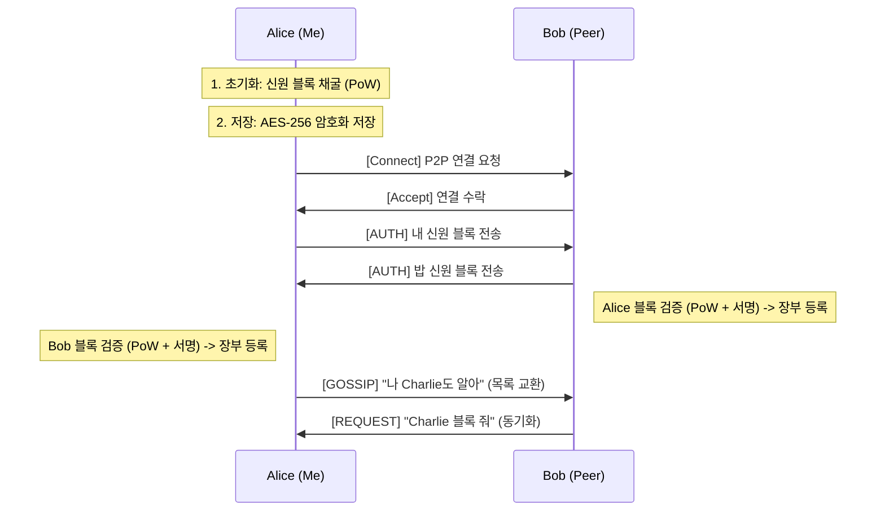

# SC-Zero : Secure Identity Messenger

> **중앙 서버 없는, 블록체인 기반 신원 인증 P2P 메신저**
> *Blockchain-based Identity Verification P2P Messenger*

**SC-Zero**는 중앙 서버 없이 작동하는 탈중앙화 메신저입니다 
단순한 P2P 통신을 넘어, **자체 블록체인(Self-Blockchain)**과 **작업 증명(PoW)** 기술을 도입하였습니다
신원 위조(Spoofing)와 시빌 공격(Sybil Attack)을 원천 차단합니다

## 🚀 Key Features (핵심 기능)

* **🔒 Blockchain Identity (블록체인 신원 인증)**
    * 모든 사용자는 접속 전 자신만의 **신원 블록(Identity Block)**을 채굴(Mining)해야 합니다
    * **PoW (Proof of Work):** 해시 난이도(`000...`)를 만족해야 하므로 대량의 가짜 계정 생성을 방지합니다
    * **Digital Signature:** 개인키로 서명된 블록만 네트워크에서 인정받습니다


* **📡 P2P Gossip Protocol (가십 프로토콜)**
    * 중앙 서버 없이 사용자 간에 서로의 신원 장부(Ledger)를 자동으로 동기화합니다
    * 연결될 때마다 없는 블록을 서로 교환(`Request`/`Response`)하여 최신 상태를 유지합니다


* **🛡️ Military-Grade Security (강력한 보안)**
    * **AES-256-GCM:** 로컬에 저장되는 신원 파일과 키 파일은 암호화되어 저장됩니다
    * **End-to-End Encryption:** Libp2p의 보안 채널을 통해 모든 통신이 암호화됩니다


* **🖥️ Modern TUI (터미널 UI)**
    * `tview` 기반의 깔끔한 터미널 인터페이스를 제공합니다
    * 실시간 로그 확인과 채팅이 동시에 가능합니다


---

## 🛠 Architecture (아키텍처)

SC-Zero는 **신뢰할 수 없는 네트워크(Trustless Network)**에서 상대를 검증하기 위해 다음과 같은 절차를 따릅니다



---

## 📦 Project Structure (폴더 구조)

```text
SC-Zero/
├── cmd/
│   └── node/
│       └── main.go       # 프로그램 진입점 (CLI 메뉴 및 초기화)
├── internal/
│   ├── blockchain/       # 블록 정의, 채굴(PoW), 장부(Ledger), 검증 로직
│   ├── core/             # 공통 프로토콜 ID, 패킷 타입 정의
│   ├── p2p/              # Libp2p 호스트, 핸드셰이크, 가십 프로토콜
│   ├── storage/          # AES-GCM 파일 암호화/복호화
│   └── ui/               # TUI (Chat View, Input, Log)
├── identity.key          # (생성됨) 암호화된 개인키
└── my_identity.enc       # (생성됨) 암호화된 내 신원 블록

```

---

## ⚡ Getting Started (실행 방법)

### Prerequisites

* Go 1.20+ installed

### Installation

```bash
go mod tidy

```

### Run (실행)

두 개의 터미널을 열어서 테스트하는 것을 권장합니다.

**Node A (Terminal 1):**

```bash
go run cmd/node/main.go
# 초기 실행 시 채굴(Mining)로 인해 1~3초 소요됩니다.
# 메뉴에서 '1. Wait'를 선택하세요.

```

**Node B (Terminal 2):**

```bash
go run cmd/node/main.go
# 메뉴에서 '2. Connect'를 선택하고 Node A의 주소를 입력하세요.

```

---

## 🎮 Usage (사용법)

### TUI Commands

* `/help` : 사용 가능한 모든 명령어와 설명을 표시합니다.
* `/connect <address>` : 상대방 노드에 연결하고 신원 인증을 수행합니다.
* `/exit` : 프로그램을 안전하게 종료합니다.
* (채팅 입력) : 연결된 모든 **검증된 피어(Verified Peer)**에게 메시지를 전송합니다.

### Status Indicators

* `[Verified Identity]` : 상대방의 블록이 수학적으로 검증됨
* `[Unverified]` : 검증되지 않은 사용자의 메시지
* `Synced Identity` : 가십 프로토콜을 통해 제3자의 신원을 동기화함

---

## 🛡️ Security Model (보안 모델)

| 위협 (Threat) | 방어 기제 (Defense Mechanism) |
| --- | --- |
| **신원 도용 (Spoofing)** | **전자서명 (Digital Signature):** 개인키가 없으면 블록 생성 불가 |
| **대량 가짜 계정 (Sybil)** | **작업 증명 (PoW):** 블록 생성 시 해시 연산 비용 강제 |
| **데이터 변조 (Tampering)** | **해시 체인 & 서명:** 내용 변경 시 해시/서명 검증 실패 |
| **중간자 공격 (MITM)** | **블록체인 검증:** 해커가 키를 바꿔치기해도 장부와 다르면 거부 |
| **로컬 탈취 (Local Theft)** | **AES-256-GCM:** 물리적 파일 탈취 시 복호화 불가능 |

---

## 📝 Roadmap (향후 계획)

* [x] P2P 기본 통신 구현
* [x] TUI 적용
* [x] 블록체인 신원 인증 (PoW) 적용
* [x] 보안 장부 동기화 (Gossip)
* [ ] **친구 목록(Whitelist) 관리 기능** (스팸 방지)
* [ ] **장부 용량 제한 (Garbage Collection)** (리소스 최적화)