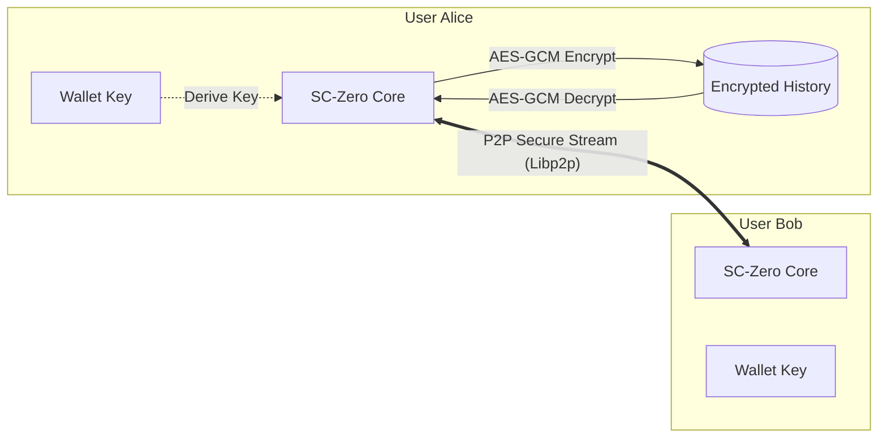

# Project: SC-Zero

### Serverless P2P Encrypted Messenger

## 1. 프로젝트 개요 (Overview)

* **개발 기간**: 2025.12.1 ~ 2025.12.14
* **소개**: 중앙 서버 없이 노드 간 직접 연결(P2P)을 통해 통신하며, 대화 내용을 로컬에 암호화하여 저장하는 탈중앙화 메신저입니다.
* **개발 동기**:
* 기존 'Zero-Knowledge Server' 방식조차 서버가 존재한다는 단일 실패 지점(SPOF)의 한계를 극복하고자 했습니다.
* **Libp2p**를 도입하여 진정한 의미의 **Serverless & Decentralized** 아키텍처를 구현했습니다.
* 전송 구간 보안(Transport Security)뿐만 아니라 저장 데이터(Data at Rest)까지 보호하는 **Full-Stack Security**를 달성했습니다.


### 프로젝트 폴더 구조

```text
SC-Zero/
├── go.mod
├── go.sum
├── cmd/
│   └── node/
│       └── main.go      # P2P 노드 엔진 (Host & Client 통합)
├── identity.key           # (Generated) 노드 신원 증명용 개인키
└── chat_history.enc     # (Generated) AES-256-GCM 암호화된 대화 로그

```

## 2. 사용 기술 (Tech Stack)

* **Language**: Go (Golang)
* **Network (P2P)**:
* **Library**: `go-libp2p` (IPFS의 핵심 네트워크 스택)
* **Protocol**: Custom Protocol ID `/sc-zero/1.0.0`
* **Discovery**: Multiaddr 기반 직접 연결 (Direct Connection)


* **Cryptography**:
* **Transport Layer**: TLS 1.3 / Noise (Libp2p 기본 보안)
* **Storage Layer**: AES-256-GCM (개인키 기반 키 파생)
* **Key Derivation**: SHA-256


* **Storage**: JSON Serialization + Binary Encryption

## 3. 핵심 기능 및 보안 설계 (Key Features)

### 1. Serverless P2P Architecture

* **중앙 서버 제거**: 중계 서버(Relay) 없이, 각 클라이언트가 **노드(Node)**가 되어 상호 직접 연결합니다.
* **검열 저항성**: 특정 IP나 서버를 차단해도, P2P 네트워크 특성상 통신을 완전히 차단할 수 없습니다.

### 2. 암호화된 로컬 저장소 (Secure Local Storage)

* **개인키 기반 저장**: 사용자의 `wallet.key`(개인키)가 없으면 복호화할 수 없는 강력한 보안 저장소를 구현했습니다.
* **AES-256-GCM**: 단순 암호화뿐만 아니라 데이터 무결성까지 검증하여, 로컬 파일이 변조되었는지 감지합니다.
* **명령어 기반 제어**:
* `/save`: 현재 메모리의 대화 내용을 암호화하여 디스크에 저장
* `/load`: 디스크의 암호문을 읽어 복호화 후 메모리에 로드


### 3. 암호학적 신원 증명 (Identity)

* **Node ID**: 로그인 ID/PW 대신, 비대칭 키 쌍(Public/Private Key)을 통해 생성된 고유한 **Node ID**를 사용합니다.
* 프로그램 재실행 시에도 `wallet.key`를 통해 동일한 신원(ID)을 유지합니다.

## 4. 시스템 아키텍처 (Architecture)

기존의 [Client-Server-Client] 구조에서 벗어나, [Peer-to-Peer] 직접 통신 구조로 진화했습니다.



**상세 설명:**

1. **P2P Transport**: Alice와 Bob은 Libp2p의 보안 채널(TLS/Noise)을 통해 직접 스트림을 형성합니다. 중간자가 개입할 서버가 존재하지 않습니다.
2. **Key Derivation**: 저장소 암호화를 위해, 노드의 고유한 개인키(Private Key)를 SHA-256 해싱하여 대칭키(AES Key)를 유도합니다.
3. **Data at Rest**: 대화 내용은 메모리에만 존재하다가, 사용자의 명시적 요청(`/save`)이 있을 때만 암호화되어 디스크에 기록됩니다.

## 5. 구현 상세 (Implementation Details)

### P2P 노드 엔진 (`cmd/node`)

* **Host 생성**: `libp2p.New()`를 사용하여 랜덤 포트에서 수신 대기하는 호스트를 생성합니다.
* **Stream Handling**: `/sc-zero/1.0.0` 프로토콜 ID로 들어오는 연결 요청을 감지하고, 비동기(Goroutine)로 읽기/쓰기를 처리합니다.

### 저장소 보안 로직

```go
// 1. 개인키로부터 저장소 전용 키 파생
key := sha256.Sum256(privateKeyBytes)

// 2. AES-GCM 암호화 (Nonce 포함)
block, _ := aes.NewCipher(key[:])
gcm, _ := cipher.NewGCM(block)
ciphertext := gcm.Seal(nonce, nonce, jsonData, nil)

```

* 파일 자체를 탈취당해도, `wallet.key` 파일이 물리적으로 분리되어 있다면 복호화가 수학적으로 불가능합니다.

## 6. 검증 및 성과 (Verification & Results)

### 1. P2P 연결성 검증

* 서로 다른 터미널(혹은 다른 PC)에서 실행된 두 노드가 중앙 서버 없이 **Node ID**와 **Multiaddr**만으로 연결에 성공함을 확인했습니다.
* `[System] Ready to chat!` 메시지와 함께 양방향 통신이 정상적으로 이루어졌습니다.

### 2. 저장소 암호화 검증

`chat_history.enc` 파일을 헥사 에디터로 분석한 결과, 평문 데이터가 전혀 노출되지 않음을 확인했습니다.

**[파일 내용 예시]**

```text
(Before Encryption)
[Alice]: Hello, this is a secret message.

(After Encryption - chat_history.enc)
jW9;cV ... (Unreadable Binary Garbage)

```

> **[결론]** 네트워크 구간(Transport)과 로컬 저장 구간(Storage) 모두에서 데이터 기밀성을 확보했습니다.

## 7. 실행 방법 (How to Run)

### 사전 준비

1. **P2P 라이브러리 설치**:
```bash
go mod tidy

```


### 실행 단계 (Peer-to-Peer)

SC-Zero는 서버가 없으므로, 두 개의 터미널에서 동일한 코드를 실행하여 서로 연결합니다.

#### 1. 노드 A 실행 (Wait Mode)

```bash
go run cmd/node/main.go
# Mode Selection > 1 (Wait) 입력

```

* 출력된 **My Addresses** 중 하나(예: `/ip4/127.0.0.1/...`)를 복사합니다.

#### 2. 노드 B 실행 (Connect Mode)

```bash
go run cmd/node/main.go
# Mode Selection > 2 (Connect) 입력

```

* **Target Address**에 복사한 노드 A의 주소를 붙여넣습니다.

#### 3. 채팅 및 저장

* 연결이 완료되면 자유롭게 대화합니다.
* **명령어 사용**:
* `/save`: 대화 내용을 암호화하여 저장
* `/load`: 저장된 대화 내용 불러오기
* `/history`: 불러온 대화 내용 출력